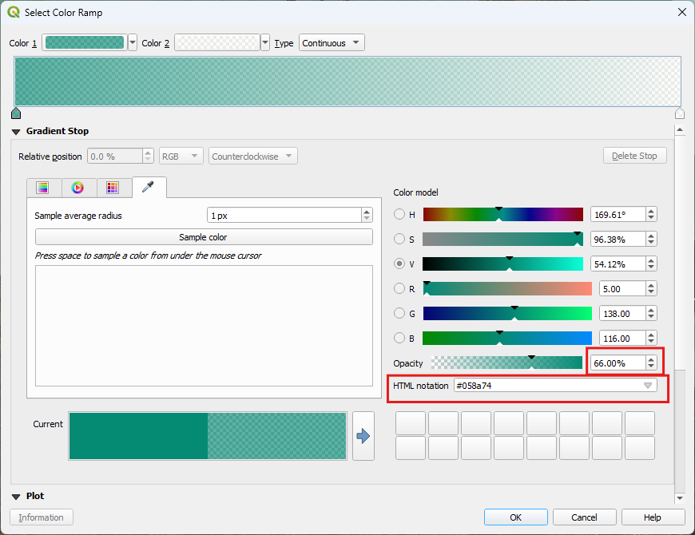
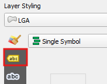

## Loading data
Loading data can occur in multiple ways. For this course, we will use the Browser and the Data Source Manager.  

One of the important aspects to an efficient mapping product, is keeping it tidy. A way to do this is to create `Groups` in the `Layers` panel.  
  
> - Create the above groups in the layers panel by right mouse clicking in the layer panel and selecting `Add group`.
>   

### Browser
Accessing the data via the `Browser` panel, we will add the data to the groups. 
> - Ensure you have the `Browser` panel open.  
>   
> - At the top of the `Browser`, click on the arrow next to `Project Home` to expand it  
>   
> - Expand the Data folder  

We are going to select multiple files and load them under the group headings 
> - First, in the `Layers` panel, click on the group 'Original data'  
>   
> - Then head over to the `Browser` panel and whilst holding down the ctrl key, click on:  
>   - 'current_distribution_RF_1.tif'  
>   - Expand the geopackage and click on all the layers*  
> - With all of these selected, click on the `Add selected layer` button at the top of the `Browser` panel  
>   
> - This results in layers nested under the 'Original data' group  
>   
> - Turn off the layers, population_centres and watercourse  

*N.B. The layers in the geopackage have been extracted from the ArcGIS REST Service from the Queensland Government. Refer to [Ref A - Add Data](https://emhain8.github.io./QGIS-Cartography-ICCB/docs/part1a-add-data.html) for step by step instructions for other methods.*   

Nearly there with the data, we just need to add in a basemap.  
> In the `Layers` panel, click on the group 'Base'  
> In the `Browser`, under `XYZ Tiles`, click on 'Qld Imagery'  
> Click on the `Add selected layer` button at the top of the `Browser` panel  

## Styling
Now it is time to style the:  
- Koala distribution: 'current_distribution_RF_1.tif'  
- LGA: local_government_area  
- Mask: seq_boundary  

### AOI Map
First, we are going to create our "AOI" map - our area of interest. For this we will want the following datasets turned on:  
- Mask: seq_boundary  
- LGA: local_government_area  
- Qld Imagery

#### Create the Mask
> - Click on the layer seq_boundary and click on `Duplicate Layer`  
> - Move this layer to the sit under the 'Mask' group  
> - Rename it to AOI (right mouse click > `Rename Layer`) and click on it so it becomes the `Active` layer  
> - Right mouse click anywhere in a blank area on the toolbar at the top and select `Panels > Layer Styling Panel`  
>   
> - In the `Layer Styling` panel, select from the drop down `Inverted Polygons'  
> - Click on `Simple Fill` and remove the outline and change the colour to white  
>   

This is the mask we want for the 'Island' look for the Grid data, but for the AOI, we want to still see the surrounds so it helps us get our bearings. To do this, we are going to create an additional style for the AOI layer.  

> - Right mouse click on the AOI Layer and click `Styles > Add`. Call this 'AOI'   
>   
> - In the Layers Styling panel, click on the Simple Fill and change it to `Shapeburst Fill`  
> - Select the Colour ramp and use a dark green (#058a74) for Color 1 and White for Color 2. Use a transparency of 66%  
> 

As you can see here, the QLD Imagery does not extend into the Coral Sea enough, so this is where we may have to replace it with another service. Ensure you have the rights to use it. An easy fix it to set the map property background colour to that of the sea. 

Let's sort out our LGA's now with boundaries and some labels.  
**Boundaries**  
> - Under 'Original data' duplicate 'local_government_area' and move the dupe into the 'Context data' group
> - Rename it 'LGA'
> - In the `Layer Styling`, click on `Simple Fill` and change the outline to a light grey (#d9d9d9)

**Labels**
> - In the `Layer Styling`, click on the label tab
> 
> - Select from the dropdown `Single Labels`
> - For the value, select 'abbrev_name'
> - Select the font 'Roboto Black', size 6
> - For the color, select the same color as the outline - this should be on the palette
> - Click on the next tab and add in Multiple lines based on spacing
> - Add a `Text Buffer` of 0.7
> - Use the color picker to select a dark color from the aerial
> - 

