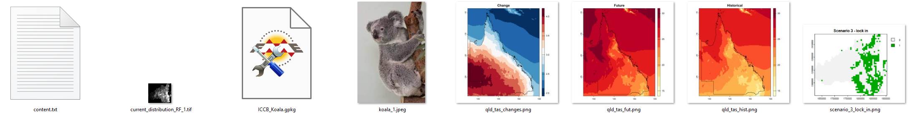

**We will cover:**
- Adding different data types (file, service and vector tiles) 
- Coordinate Reference Systems (CRS)
- Creating and loading styles

## Data types
  
In this course, we will be using vector and raster spatial data as well as images to complete our poster.  
### Vector data
Point
- Population_centres
Line
- Rivers
Polygon
- Local Government Boundaries
- SEQ boundary

### Raster data
Geotiff
- current_distribution_RF_1.tiff

### Additional data
Images
- koala_1.jpeg
- qld_tas_changes.png 
- qld_tas_fut.png 
- qld_tas_hist.png
- scenario_3_lock_in.png

All text for the captions can be found in the content.txt

## Loading data
Loading data can occur in multiple ways. For this course, we will use the Browser and the Data Source Manager.  

One of the important aspects to an efficient mapping product, is keeping it tidy. A way to do this is to create `Groups` in the `Layers` panel.  
  
> - Create the above groups in the layers panel by right mouse clicking in the layer panel and selecting `Add group`.
>   

### Browser
Now we will add the data to the groups. 
> - Ensure you have the `Browser` panel open.  
>   
> - At the top of the `Browser`, click on the arrow next to `Project Home` to collapse it  
>   
> - Collapse the Data folder  

We are going to select multiple files and load them under the group headings 
> - First, in the `Layers` panel, click on the group 'Original data'  
>   
> - Then head over to the `Browser` panel and whilst holding down the ctrl key, click on *current_distribution_RF_1.tif*, and the *seq_boundary* (in the geopackage)  
> - With all of these selected, click on the `Add selected layer` button at the top of the `Browser` panel  
>   
> - This results in layers nested under the 'Original data' group  
>   

Data source manager
- service
- rivers

