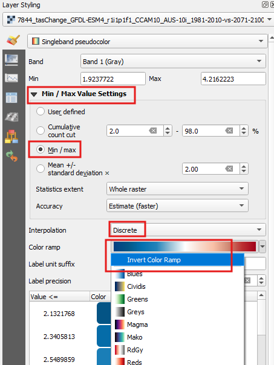
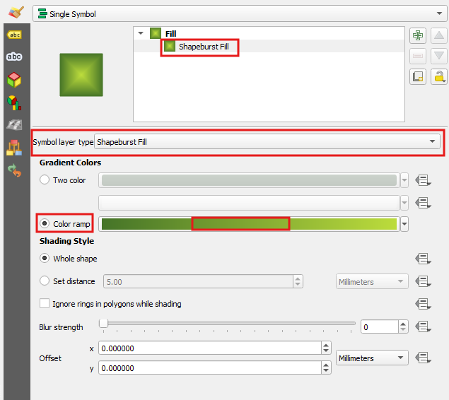

We will cover the following:

- Organise your layers to make you efficient
- Replacing datasets
- Choosing your colors for you brand via your own palette
- Creating a mask to focus your views on your data
- Use a cool basemap
- Create Map themes

# Let's start!
> - Load up from the data folder: *Products\ICCB_Koala_data.qgz*
  
# Efficiencies

- Groups
- Templates

## Groups

- Good for dealing with lots of data
- Use them for EIS where you have many datasets that are used across different projects

Try it yourself, create a group called ‘working’. This is a great place to dump layers that won’t be used in the final product or for layers you are testing analysis or styling on. 

> - In the `Layers panel`, right click on the top group ‘ICCB Koala’
> - Click `Add Group` and name it working

## Templates
Templates are great for saving time. You’ve spent all the time to develop something, now you can re-use it.

### Layer Definition files .sld
Layer definition files gives you a way to group a lot of data files together in a prescribed order e.g. base vector layers such as ocean, built up areas, waterways
- Prepopulated with the base data and styles you always use and styled. 
- All the groups/layers need to be listed under a parent group
- Can replace the datasets with updated versions without having to redo everything in the Map Canvas or Print Layout
  - Keeps the preferred name
  - Keeps the styling

> Try it for yourself, on a fresh QGIS, load up the from the data folder: ICCB\_koala\_groups\_data.qlr

### Layer styles .qlr
Save a layer’s symbology to reuse your favourite styles to apply elsewhere.

### Styles .xml
These are helpful to make a portable group of symbols that you like. You can import them into the Styling Manager and into other programs. 

### Palette .gpl

Used across open source programs, a palette .gpl file will enable you to bring in branding or specific palettes into QGIS.

### Print Templates .qpt

Once you have the set-up you need, you can reuse your print layout. It can be more powerful once you start using dynamic text and variables. 

# The data we have

## Original data management

All of the original data is loaded into the 'Original data' group. This is good to have there to reference the original datasets just in case something happens, they can be quickly sourced. 

## Gremlins in the data

Some data has been prepared for you 

- Group 2 Overall Change - projections issue
- Created the state border and coastline
- Basemap Imagery 
  - Fixing the extent - we will do that below
  - When you are stuck - usage rights fo Google/Bing & etc
## Basemaps
The Coastline layer and the Aerial is from the QLD Government.  
We are using the Coastline as a background to the raster data gives great texture through its treatment of relief. I tend to use the greyscale version of it. 

# Ok Let's to it!

## Create a Palette
We all consume branding everyday and choosing a palette of colors is a part of it. Artists will also look to a set of colors, a palette, to help harmonise their work. So let's create a palette from the Koala picture you have.  

> - In the `Layers` panel, expand the 'Decorations' group  
> - Right mouse click on the 'koala_1.jpeg'and click on `Zoom to layers`  
> - On the top menu, click on `Settings > Options'  
> - In the `Options`, select `Colors` on the left side  
  
> - Click on the drop down where it says *Standard colors* and select *Project colors*

A number of colors have already been added to save time. 

  

> - Click on the green plus button to bring up the `Select color` dialog
  
> - Click on the `Sampling`tab  
> - To start collecting the colors for the palette click the `Sample color`button  
> - Click anywhere on the image to capture a color and click `OK`

> - click `OK`  
> - **Save your project**  

These project colors are now built into this project file. They will appear when you go to the palette option to select colors. 

# Style Layers

## Load a style
We have a style file `data/projected_suitability.qml` and we are going to apply it to one of the layers.

> - In the Map 4 group, right click the 'future370-current' layer and click on `Properties`
> - At the bottom of the dialog, click on the `Style` button and select `Load Style...`

  

> - Click on the folder browser button (...)
> - Navigate to the Product folder and select `data/projected_suitability.qml`
> - Click 'Open' and then `Load Style`
> - Click 'OK' to close the `Layer Properties`
> - Set the opacity to 80% (second tab)
> - **Save your project**

The data should now have a blue to red color ramp applied to it. 

## Copy a style
Using styles across multiple layers works for rasters that represent the same theme. In this instance, we are going to adapt Map 4's style for Map 2.

> - In the Map 4 group, right click the 'future370-current' layer
> - Click `Style > Copy Style > All Style Categories`
> - In the Map 2 group, right click the '7844_tasChange_GFDL-ESM4_r1i1p1f1_CCAM10_AUS-10i_1981-2010-vs-2071-2100' layer
> - Click `Style > Paste Style > All Style Categories`
> - Zoom to the '7844_tasChange_GFDL-ESM4_r1i1p1f1_CCAM10_AUS-10i_1981-2010-vs-2071-2100' layer
> - Click the `Layer Styling` panel
> - Expand the `Min/Max Value Settings'
> - Click 'Min/Max' to reset the values to the current dataset
> - Set the 'Interpolation' to 'Discrete'
> - Right click in the color ramp bar and click 'Invert Color Ramp'
> - Set the opacity to 80% (second tab)
> - **Save your project**

The number of classes are what we require (11), but for other times, this would be something to check. 

## Load a color ramp from file
Map 3 is to show the suitability for Koalas in the current climatic conditions, so let's use a color reflective of that. As we don't have a lot of time, we are going to chose a color ramp created from the palette, but you can amend this from the colors in your palette.

> - In the Map 3 group, right click the 'future370-current' layer
> - In the `Layer Style` panel, choose the style type 'Singleband pseudocolor'
> - Ensure the 'Interpolation' is 'Linear'
> - Click on the color ramp dropdown > 'All color ramps' > 'koala'
> - Set the opacity to 80% (second tab)
> - **Save your project**

## Use no data
For map 5, the Koala priority areas, it is a binary datasets - so either a 0 or 1. We are going to use the relief as a base and color the value 1 as a transparent red.

> - In the map 5 group, click on the 'scenario_4' layer
> - Change the type to 'Single Color'
> - Click in the color band, and select the red from the project palette colors or use the code #bc3030
> - Click the second tab down 'Transparency'
> - In the 'Additional NoData value' enter in 0 to remove them from the map
> - Change the 'Gloabl Opacity to 66%
> - **Save your project**

## Create the Mask

> - Under 'Original data' turn on the layer seq_boundary and zoom to it (right mouse click)
> - Right mouse click on it and select `Duplicate Layer`  
> - Move this layer to the sit under the 'Mask' group  
> - Rename it to AOI (right mouse click > `Rename Layer`) and click on it so it becomes the `Active` layer  
> - Right mouse click anywhere in a blank area on the toolbar at the top and select `Panels > Layer Styling Panel`  

   

> - In the `Layer Styling` panel, select from the drop down `Inverted Polygons'  
> - Click on `Simple Fill` and remove the outline and change the colour to white and then to remove the line, change the 'Stroke style' to 'No line'

> - **Save your project**  

We want to add in an additional effect here to create a shadow look.

> - Create a new style for the layer AOI called 'shadow'
> - In the `Layer Style` panel, down the bottom, check the box next to 'Draw effects'
> - Click on the star button on the same line
> - Check 'Inner' Shadow and check the parameters are the same as the picture below

  

This is the mask we want for the 'Island' look for the Grid data, but for the AOI, we want to still see the surrounds so it helps us get our bearings. To do this, we are going to create an additional style for the AOI layer.  

> - Right mouse click on the AOI Layer and click `Styles > Add`. Call this 'AOI'   
>   
> - In the Layers Styling panel, click on the Simple Fill and change it to `Shapeburst Fill`

The `Shapeburst Fill` is a great effect and can also be used for styling water bodies. But we are going to create a transparent mask so we can still see the aerial image under it 
> - For the `Gradient Colours` select the `Colour ramp` option and click in the color bar to bring up our options.  
>   

We are going to use the greens from our `Project colors` palette  

> - For Color 1, select the darkest green you have or use #3b3e29
> - Make it 66% transparent
> - For Color 2, select white
> - Make it 66% transparent
> - Click ok
>   
> - **Save your project**  

Last step for this AOI, we want to make it more transparent.  

> - In `Layer Styling`, at the bottom, expand the `Layer Rendering` options  
> - Next to `Opacity` click in the percentage field and make it 66%  
>    

As you can see here, the QLD Imagery does not extend into the Coral Sea enough, so this is where we may have to replace it with another service. Ensure you have the rights to use it. An easy fix it to set the map property background colour to that of the sea. 

> - Make sure only the QLD Imagery layer is turned on
> - On the top menu, click on `Project > Properties`
> - Next to 'Background color', click in the color bar
> - Click on the `Sample tab` and `Sample color` button
> - Click close to the edge of the ocean to pick up the darkest blues to use
> - Click 'OK'
> - Click 'Apply' and 'OK' in the `Project Properties`

 

## Map Themes
Map themes are a way to collate selected layers together, so that they can be used in a map to show a theme. For instance, when doing an EIS (Environmental Investigation Study), you need to keep certain layers like the study area, rivers & etc but you need to change through different disciplines like flora, fauna, flooding, and other constraints.

There are already map themes 3-6 loaded, so let's load 1-3. 

**Map 1 - AOI**

> - Make sure the ONLY the following layers are turned on:
>   -   AOI (style = AOI)
>   -   LGA (style = default)
>   -   QLD Imagery

*Hint - to turn off all of your layers, Right click the 'ICCB' group and click on 'Uncheck and All of its children'
   
> - At the top of the layers, click the eye dropdown `Manage Map Themes`
> - Click 'Add Theme'
> - Name the theme '1 AOI'
> - **Save your project**  

**Map 2 - Overall Change**

> - Make sure the ONLY the layers in the group '2 Overall Change (climate downscaled model) - s2' are turned on
> - At the top of the layers, click the eye dropdown
> - Click 'Add Theme'
> - Name the theme '2 Overall Change (climate downscaled model)'
> - **Save your project**

Now let's update the rest of the map themes with the Mask Layer - but this time, we want the one that makes them look like an 'island'.

> - Turn on the map theme '3 Climatic suitability for koalas'
> - Make sure the ONLY the layers in the group '3 Climatic suitability for koalas - s3' are turned on
> - Turn on the AOI layer using the style 'shadow'
> - Click `Manage Map Themes > Replace Theme` and select '3 Climatic suitability for koalas - s3'
> - **Save your project**

Repeat for map themes 4 and 5 by adding in the AOI layer using the style 'shadow'.
