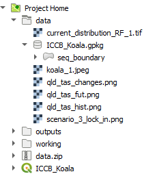
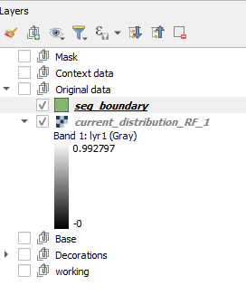

## Loading data
Loading data can occur in multiple ways. For this course, we will use the Browser and the Data Source Manager.  

One of the important aspects to an efficient mapping product, is keeping it tidy. A way to do this is to create `Groups` in the `Layers` panel.  
  
> - Create the above groups in the layers panel by right mouse clicking in the layer panel and selecting `Add group`.
>   

### Browser
Accessing the data via the `Browser` panel, we will add the data to the groups. 
> - Ensure you have the `Browser` panel open.  
>   
> - At the top of the `Browser`, click on the arrow next to `Project Home` to expand it  
>   
> - Expand the Data folder  

We are going to select multiple files and load them under the group headings 
> - First, in the `Layers` panel, click on the group 'Original data'  
>   
> - Then head over to the `Browser` panel and whilst holding down the ctrl key, click on:
>   - 'current_distribution_RF_1.tif'
>   - Expand the geopackage and click on all the layers*
> - With all of these selected, click on the `Add selected layer` button at the top of the `Browser` panel  
>   
> - This results in layers nested under the 'Original data' group  
>   

*N.B. The layers in the geopackage have been extracted from the ArcGIS REST Service from the Queensland Government. Refer to [Ref A - Add Data](https://emhain8.github.io./QGIS-Cartography-ICCB/docs/part1a-add-data.html) for step by step instructions for other methods.*   
