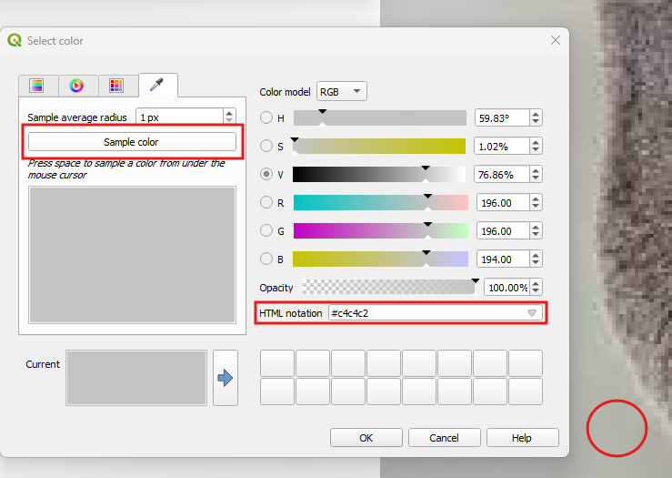
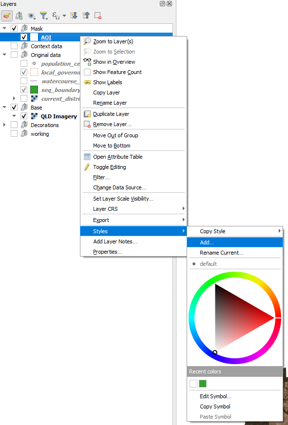

# Styling
We will cover the following:

- Organise your layers to make you efficient
- Replacing datasets
- Choosing your colors for you brand via your own palette
- Creating a mask to focus your views on your data
- Labeling
- Creating a color ramp
- Use a cool basemap
- Create Map themes 

## Create a Palette
We all consume branding everyday and choosing a palette of colors is a part of it. Artists will also look to a set of colors, a palette, to help harmonise their work. So let's create a palette from the Koala picture you have.  

> - In the `Layers` panel, expand the 'Decorations' group  
> - Right mouse click on the 'koala_1.jpeg'and click on `Zoom to layers`  
> - On the top menu, click on `Settings > Options'  
> - In the `Options`, select `Colors` on the left side  
>    
> - Click on the drop down where it says *Standard colors* and select *Project colors*

A number of colors have already been added to save time. 

  

> - Click on the green plus button to bring up the `Select color` dialog
>   
> - Click on the `Sampling`tab  
> - To start collecting the colors for the palette click the `Sample color`button  
> - Click anywhere on the image to capture a color and click `OK`
> 
> - click `OK`  
> - **Save your project**  

These project colors are now built into this project file. They will appear when you go to the palette option to select colors. 

### Create the Mask

> - Under 'Original data' turn on the layer seq_boundary and zoom to it (right mouse click)
> - Right mouse click on it and select `Duplicate Layer`  
> - Move this layer to the sit under the 'Mask' group  
> - Rename it to AOI (right mouse click > `Rename Layer`) and click on it so it becomes the `Active` layer  
> - Right mouse click anywhere in a blank area on the toolbar at the top and select `Panels > Layer Styling Panel`  
>   
> - In the `Layer Styling` panel, select from the drop down `Inverted Polygons'  
> - Click on `Simple Fill` and remove the outline and change the colour to white  
> 
> - **Save your project**  

This is the mask we want for the 'Island' look for the Grid data, but for the AOI, we want to still see the surrounds so it helps us get our bearings. To do this, we are going to create an additional style for the AOI layer.  

> - Right mouse click on the AOI Layer and click `Styles > Add`. Call this 'AOI'   
>   
> - In the Layers Styling panel, click on the Simple Fill and change it to `Shapeburst Fill`

The `Shapeburst Fill` is a great effect and can also be used for styling water bodies. But we are going to create a transparent mask so we can still see the aerial image under it 
> - For the `Gradient Colours` select the `Colour ramp` option and click in the color bar to bring up our options.  
>   

We are going to use the greens from our `Project colors` palette  

> - For Color 1, select the darkest green you have  
> - For Color 2, select white  
> - Click ok
>   
> - **Save your project**  

Last step for this AOI, we want to make it transparent.  

> - In `Layer Styling`, at the bottom, expand the `Lyaer Rendering` options  
> - Nect to `Opacity` click in the percentage field and make it 66%  
>    

As you can see here, the QLD Imagery does not extend into the Coral Sea enough, so this is where we may have to replace it with another service. Ensure you have the rights to use it. An easy fix it to set the map property background colour to that of the sea. 

> - Make sure only the QLD Imagery layer is turned on
> - On the top menu, click on `Project > Properties`
> - Next to 'Background color', click in the color bar
> - Click on the `Sample tab` and `Sample color` button
> - Click close to the edge of the ocean to pick up the darkest blues to use
> - Click 'OK'
> - Click 'Apply' and 'OK' in the `Project Properties`

 

