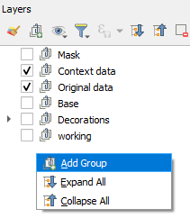

**We will cover:**
- Adding different data types (file, service and vector tiles) 
- Coordinate Reference Systems (CRS)
- Creating and loading styles

## Data types
  
In this course, we will be using vector and raster spatial data as well as images to complete our poster.  
### Vector data
Point
- Population_centres
Line
- Rivers
Polygon
- Local Government Boundaries
- SEQ boundary

### Raster data
Geotiff
- current_distribution_RF_1.tiff

### Additional data
Images
- koala_1.jpeg
- qld_tas_changes.png 
- qld_tas_fut.png 
- qld_tas_hist.png
- scenario_3_lock_in.png

All text for the captions can be found in the content.txt

## Loading data
Loading data can occur in multiple ways. For this course, we will use the Browser and the Data Source Manager.  

One of the important aspects to an efficient mapping product, is keeping it tidy. A way to do this is to create `Groups` in the `Layers` panel.  
  
> Create the above groups in the layers panel by right mouse clicking in the layer panel and selecting `Add group`.
> 

### Browser
Now we will add the data to the groups. 
> Ensure you have the Browser Panel open.
> Since you have saved your project to the Product folder, this is now identified as the `Project Home` thus making it easier to access.

Data source manager
- service
- rivers

