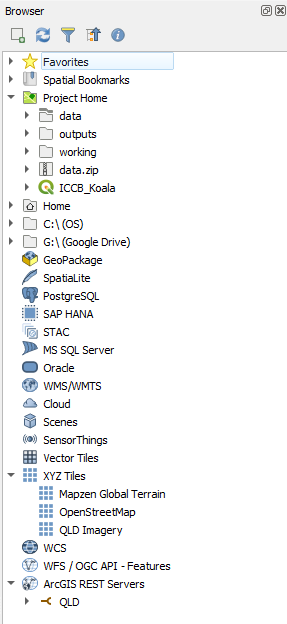
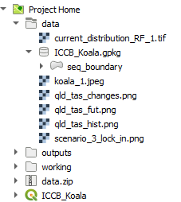
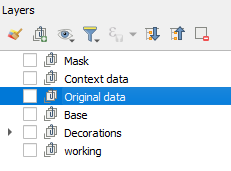
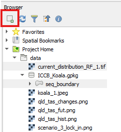
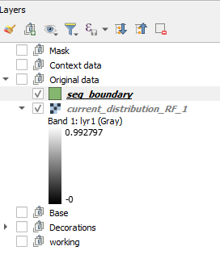
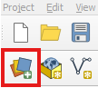
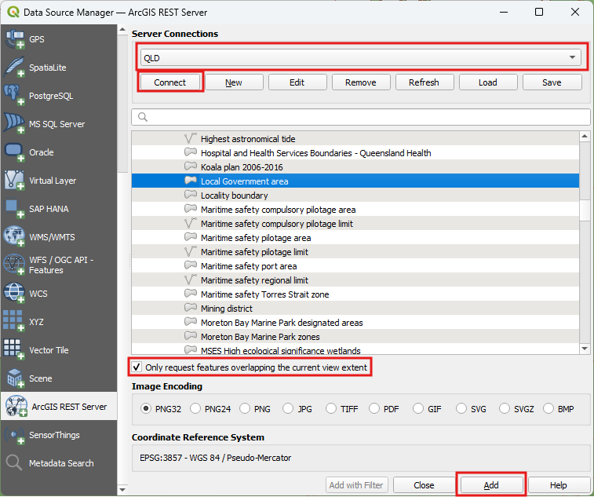
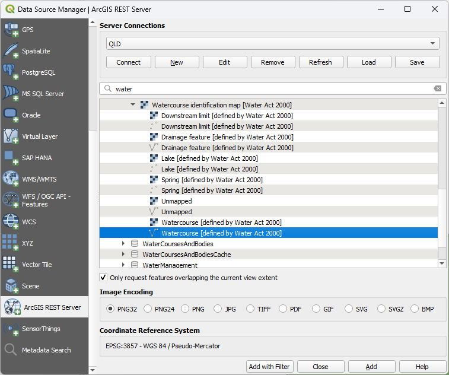
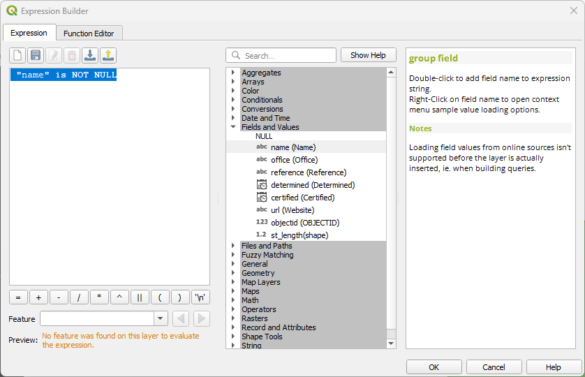
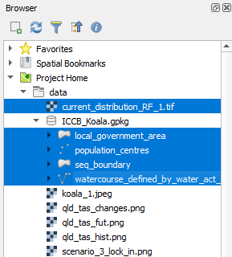

## Data types
  
In this course, we will be using vector and raster spatial data as well as images to complete our poster.  
### Vector data
Point
- Population_centres
Line
- Rivers
Polygon
- Local Government Boundaries
- SEQ boundary

### Raster data
Geotiff
- current_distribution_RF_1.tiff

### Additional data
Images
- koala_1.jpeg
- qld_tas_changes.png 
- qld_tas_fut.png 
- qld_tas_hist.png
- scenario_3_lock_in.png

All text for the captions can be found in the content.txt

## Loading data
Loading data can occur in multiple ways. For this course, we will use the Browser and the Data Source Manager.  

One of the important aspects to an efficient mapping product, is keeping it tidy. A way to do this is to create `Groups` in the `Layers` panel.  
  
> - Create the above groups in the layers panel by right mouse clicking in the layer panel and selecting `Add group`.
>   

### Browser
Accessing the data via the `Browser` panel, we will add the data to the groups. 
> - Ensure you have the `Browser` panel open.  
>   
> - At the top of the `Browser`, click on the arrow next to `Project Home` to expand it  
>   
> - Expand the Data folder  

We are going to select multiple files and load them under the group headings 
> - First, in the `Layers` panel, click on the group 'Original data'  
>   
> - Then head over to the `Browser` panel and whilst holding down the ctrl key, click on 'current_distribution_RF_1.tif', and the 'seq_boundary' (in the geopackage)  
> - With all of these selected, click on the `Add selected layer` button at the top of the `Browser` panel  
>   
> - This results in layers nested under the 'Original data' group  
>   

### Data source manager
We are going to access some data now from the service we have loaded. We can use the `Browser` panel to do so, but to select data that only occurs in the map extent. In this instance, our Area of Interest - South East Queensland.   
> - In the `Layers` panel, select turn on the 'seq_boundary' layer  
> - Right mouse click on the layer and select `Zoom to layer`  
> - Click on the `Open Data Source Manager' button  
>   
> - On the left hand side of the `Data Source Manager`scroll down until you see the ArcGIS REST Server and click on it  
> - On the right hand side, click the drop down and select 'QLD' (or whatever you named the Qld Spatial Government service)  
> - Click on `Connect`  
> - Click on Boundaries > AdminBoundariesFramework > Local Government area (you will need to scroll down quite a bit)
> - Tick `Only request features overlapping the current view extent`  
> - Click on `Add`  
>  

We won't close this yet as we need to add in watercourses.

> - Above the layer list, there is a search bar, type in 'water', we are looking for polyline dataset for a river  
> - Expand 'Inland River' and select 'WatercourseIdentificationMap' > 'Watercourse'
> 
> - Click `Add with Filter`  
> - The `Expression Builder` will come up. Add in the following ` "name" is NOT NULL` and click on `OK`
> 
> - Click `Add`, then `Close`
> - Turn off the watercourse dataset as we do not need it at the moment. 

Now add in Population centres using the Data source manager - but be careful to select only those covering the extent.  
- It is in the QLD service under Location > Places  
- Use the search function to find it quickly  

## Loading data
Loading data can occur in multiple ways. For this course, we will use the Browser and the Data Source Manager.  

One of the important aspects to an efficient mapping product, is keeping it tidy. A way to do this is to create `Groups` in the `Layers` panel.   

  
> - Create the above groups in the layers panel by right mouse clicking in the layer panel and selecting `Add group`.  
>   

### Browser
Accessing the data via the `Browser` panel, we will add the data to the groups. 
> - Ensure you have the `Browser` panel open.  
>   
> - At the top of the `Browser`, click on the arrow next to `Project Home` to expand it  
>   
> - Expand the Data folder  

We are going to select multiple files and load them under the group headings 
> - First, in the `Layers` panel, click on the group 'Original data'  
>   
> - Then head over to the `Browser` panel and expand the data folder.  
We want to select multiple files and load them into the 'Original data' group. We can do this by holding down the ctrl key whilst clicking on multiple the files.
> - Hold down the `ctrl`key, and click on the following files
>   - 'current_distribution_RF_1.tif'  
>   - Expand the geopackage and click on all the layers*  
> - With all of these selected, click on the `Add selected layer` button at the top of the `Browser` panel  
>   
> - This results in layers nested under the 'Original data' group  
>   
> - Turn off the layers, population_centres and watercourse  
> - **Save your project**  

*N.B. The layers in the geopackage have been extracted from the ArcGIS REST Service from the Queensland Government. Refer to [Ref A - Add Data](https://emhain8.github.io./QGIS-Cartography-ICCB/docs/part1a-add-data.html) for step by step instructions for other methods.*   

Nearly there with the data, we just need to add in a basemap.  
> - In the `Layers` panel, click on the group 'Base'  
> - In the `Browser`, under `XYZ Tiles`, click on 'Qld Imagery'  
> - Click on the `Add selected layer` button at the top of the `Browser` panel

Next, we are going to add in the picture of the Koala. We are doing this as we want to be a little bit clever for some tricks later on. Usually we would just add the picture to the Print Layout. 
> - In the `Layers` panel, click on the group 'Decorations'
> - In the `Browser`, under the 'Data' folder, click on koala_1.jpeg
> - Click on the `Add selected layer` button at the top of the `Browser` panel
> - **Save your project**  
