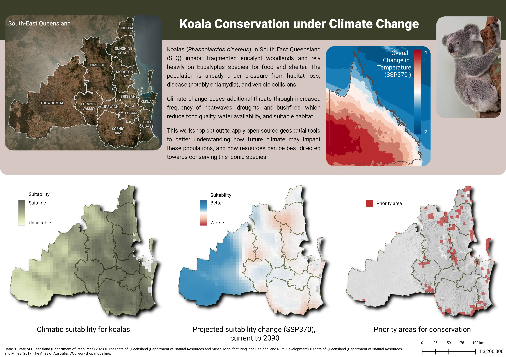
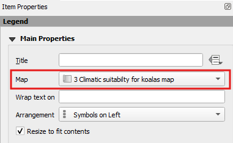
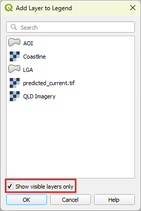
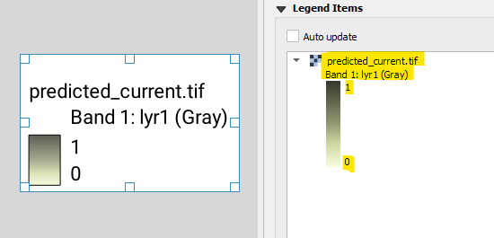
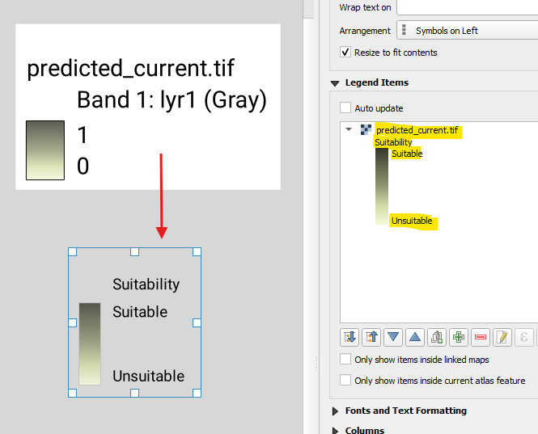
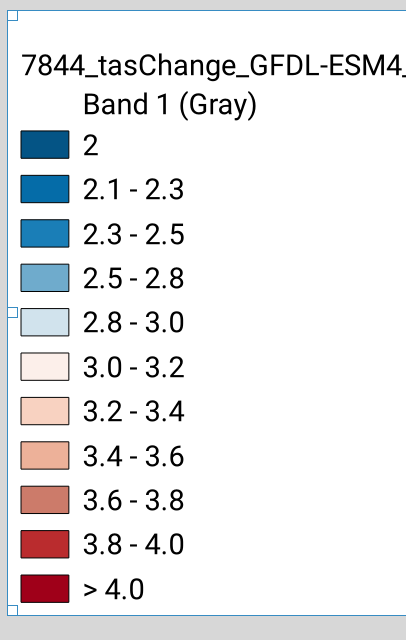
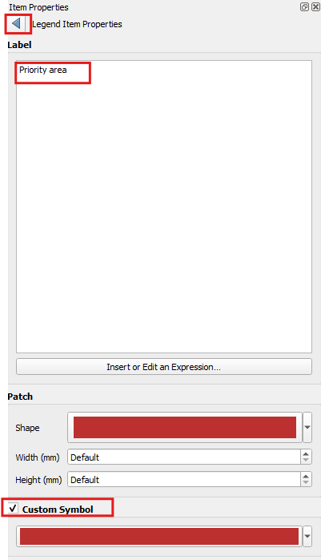

## All the details
### Maps, Scale and Position on Page

| ID | Map        | Map Theme | Title | Scale | X  | Y  | Width | Height | Legend | Note |
|-----|------------|-----|-------------|--------|-------------|-----|-----|-----|-----|-----|
| 1 | Area of Interest (AOI) | 1 AOI | South-East Queensland (white 10pt)| 1:3200000 | 2.596 | 8.795 | 92.638 | 79.841 | n/a | Decoration 'shape' |
| 2 | Overall Change (climate downscaled model) - s2 | 2 Overall Change (climate downscaled model) | Overall Change in Temperature (SSP370 ) (white 10pt) | 1:24990123 | 188.025 | 25.558 | 68.037 | 73.848 | Color ramp taken from dummy 'Legend'; 2 to 4 | Use the projection option in the Print Layout to change to 4326 |
| 3 | Climatic suitability for koalas - s3  | 3 Climatic suitability for koalas | Climatic suitability for koalas (black 12pt)  | 1:3200000 | 0.000 | 102.906 | 98.000 | 90.000 | Color ramp; Unsuitable to Suitable | n/a |
| 4 | Climatic suitability for koalas - s3  | 4 Projected suitability change (SSP370) | Projected suitability change (SSP370), current to 2090  (black 12pt) | 1:3200000 | 99.500 | 102.906 | 98.000 | 90.000 | Color ramp; Worse to Better | n/a |
| 5 | Koala priority areas - s4  | 5 Priority areas | Priority areas for conservation (black 12pt)  | 1:3200000 | 199.000 | 102.906 | 98.000 | 90.000 | Legend | n/a |
| 6 | Koala image  | 6 Koala image | n/a | 1:4517.773 | 255.990 | 0.500 | 48.812 | 83.954 | Legend | Decoration 'shape' |

### Other elements and Position on Page

| ID | Map        | Font | Size | Color | X  | Y  | Width | Height | Alignment/Type | Note |
|-----|------------|-----|-------------|--------|-------------|-----|-----|-----|-----|-----|
| 1 | Scale text  | Roboto | 8 | Black | 280.056 | 204.100 | 18.113 | 5.752 | Numeric | n/a |
| 2 | Scale bar  | Roboto  | 6 | Black | 245.883 | 199.350 | 39.616 | 10.650 | Line Ticks Middle or your choice| Segments: left;0/right 4, Fixed width 25.0 units|
| 3 | Data credentials  |  Roboto  | 6 | Black | 2.596 | 204.100 | 236.516 | 4.412 | Left | Uses dynamic and free text |
| 4 | Problem statement  | Roboto | 10 | Black | 98.000 | 27.036 | 90.113 | 70.891 | Justify | Html, Line height 130% |
| 5 | Pink rectangle  |  n/a  | n/a | 1:4517.773 | 0.000 | 17.515 | 297.000 | 85.641 | n/a | Decoration 'shape' |
| 6 | Green rectangle  |  n/a  | n/a | #3b3e29 | 0.000 | 0.000 | 297.000 | 23.300 | n/a | Decoration 'shape' |
| 7 | Main Title  | Roboto 'Black' | 21 | White | 95.235 | 9.473 | 160.756 | 8.042 | Centre | Center to the AOI and Koala elements |

**Things to note:**

- The scale is the same for all the maps, except the the Overall Change in Temperature
- `Position and Size` controls can be used to finely position and make the maps uniform

## 1 Set up the map text type

> - **Save your project**

## 2 Add in the decorations

> - **Save your project**

## 3 Add in the koala
- add in the frame

> - **Save your project**

## 4 Add in the maps x5
- add in the frame

> - **Save your project**

## 5 Add in the legends
The legend operations in QGIS is super powerful and there is ongoing development work. North Road has developed quite a few of the functions you will use. You don't have to accept how a legend item comes in. You can change how it looks, through sizing, font and formats. We are going to amend the text and size of the legends and also add in some proxy legends for visual purposes. 

> - On the top menu `Add Item > Add Legend`
> - Draw a box to place the legend anywhere on the map (we will move it later)
> - Ensure the legend matches your Map

  

> - Under the `Legend Item` section, uncheck `Auto update`
> - Select all the legen items in the window and delete them by click the red 'minus' sign below the window
> - Click on the green 'plus' sign
> - In the dialog `Add Layer to Legend`, click on the 'Show visible layers only`

  

> -  Add in the required data

Now this legend looks super clunky, so we are going make a little bit better.

  
  

### For maps 3-4
Let's amend the text in the legend item:

> - In the `Legend Items`, right mouse click on the title of dataset, and click 'Hidden'
> - Double click on the ramp title 'Band 1:...' - this will take you into an editing widget
> - Replace the text with the legend title to reflect the values of the ramp e.g. 'Suitability'
> - Now, double click on the vertical ramp itself
> - In `Minimum` and `Maximum`, enter the required values
> - Expand `Fonts and Text Formatting` and click on the `Item font` - change this 8

Let's amend the symbol size

> - Next expand `Symbol` and change the width to 4.00mm and the height to 15.00mm
> - Position it to the upper left of the assocaited map
> - **Save your project**

*Repeat for map 4 - hint, you can copy and paste legends and change the content. This will keep the same format for font/size*

### Proxy legends 
Sometimes a legend does not work in your favour, so you need to do some magic.  

**Map 2 - Overall Change in Temperature**  
In this instance, the raster styling is 'Discrete' and therefore returns a legend such as this:  

  

But we want to put in a ramp here, if the product was more technical, then we would spend the time in amending it through the size of the symbol and cutting out the spaces between the symbols and removing the black outline. However, I want you to learn how to approach a problem like this by using a proxy. 

> - Switch back to the `Map Canvas`, under the 2 Map group, dupliate the data and call it 'legend'
> - Change the Interpolation to 'Linear'
> - **Save your project**
> - Switch back to the `Print Layout`
> - Add a legend item and make sure it's linked to the map 2
> - Add in the 'legend' dataset for it
> - Run through the amendements as per last exercise
> - **Save your project**

**Map 5 - Priority Areas for Conservation**
For some reason, the scenario dataset is not showing up, so we are going to create one from another dataset. 

> - Create a legend item and remove all of the items
> - Link it to map 5
> - Add in the dataset 'AOI'
> - Double click on the dataset to open up the `Legend Item Properties`
> - Change the text to 'Priority area'
> - Check the `Custom Symbol` and click in the color bar
> - Enter in the color code '#bc3030'
> - Click on the back arrow at the top
> - Under `Symbol`, make it a square - enter in the width 4.00mm and height 4.00mm into the fields
> - **Save your project**

  

## 6 Add in the text
### Problem statement to add
The text we want to use is:  

Koalas (*Phascolarctos cinereus*) in South East Queensland (SEQ) inhabit fragmented eucalypt woodlands and rely heavily on Eucalyptus species for food and shelter. The population is already under pressure from habitat loss, disease (notably chlamydia), and vehicle collisions. Climate change poses additional threats through increased frequency of heatwaves, droughts, and bushfires, which reduce food quality, water availability, and suitable habitat. This workshop set out to apply open source geospatial tools to better understanding how future climate may impact these populations, and how resources can be best directed towards conserving this iconic species. 

But as we need to itlaicised the scientific name, we need to turn this into HTML text:

```<p> Koalas (<i>Phascolarctos cinereus</i>) in South East Queensland (SEQ) inhabit fragmented eucalypt woodlands and rely heavily on Eucalyptus species for food and shelter. The population is already under pressure from habitat loss, disease (notably chlamydia), and vehicle collisions. </p>
<p>Climate change poses additional threats through increased frequency of heatwaves, droughts, and bushfires, which reduce food quality, water availability, and suitable habitat. </p>
<p>This workshop set out to apply open source geospatial tools to better understanding how future climate may impact these populations, and how resources can be best directed towards conserving this iconic species. </p>
```

> - **Save your project**

## 7 Scale bar and text
The scale bar option has many options, including the scale text known as `Numeric`
> - On the top menu `Add Item > Add Scale Bar`
> - Draw a box to place the Scale Bar anywhere on the map (we will move it later)
> - In the `Item Properties`
Change font via `Appearance > Font`

> - **Save your project**

## 8 Print your map and review it
