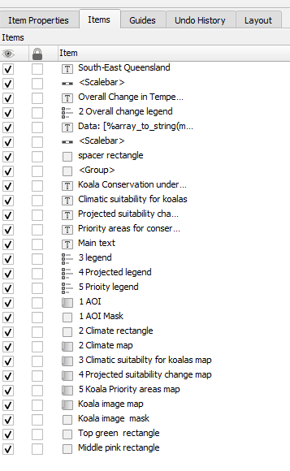

## All the details
### Maps, Scale and Position on Page

| ID | Map        | Map Theme | Title | Scale | X  | Y  | Width | Height | Legend | Note |
|-----|------------|-----|-------------|--------|-------------|-----|-----|-----|-----|-----|
| 1 | Area of Interest (AOI) | 1 AOI | South-East Queensland (white 10pt)| 1:3200000 | 2.596 | 8.795 | 92.638 | 79.841 | n/a | Decoration 'shape' |
| 2 | Overall Change (climate downscaled model) - s2 | 2 Overall Change (climate downscaled model) | Overall Change in Temperature (SSP370 ) (white 10pt) | 1:24990123 | 188.025 | 25.558 | 68.037 | 73.848 | Color ramp taken from proxy 'Legend'; 2 to 4 | Use the projection option in the Print Layout to change to 4326 |
| 3 | Climatic suitability for koalas - s3  | 3 Climatic suitability for koalas | Climatic suitability for koalas (black 12pt)  | 1:3200000 | 0.000 | 102.906 | 98.000 | 90.000 | Color ramp; Unsuitable to Suitable | n/a |
| 4 | Climatic suitability for koalas - s3  | 4 Projected suitability change (SSP370) | Projected suitability change (SSP370), current to 2090  (black 12pt) | 1:3200000 | 99.500 | 102.906 | 98.000 | 90.000 | Color ramp; Worse to Better | n/a |
| 5 | Koala priority areas - s4  | 5 Priority areas | Priority areas for conservation (black 12pt)  | 1:3200000 | 199.000 | 102.906 | 98.000 | 90.000 | proxy 'Legend' | n/a |
| 6 | Koala image  | 6 Koala image | n/a | 1:4517.773 | 255.990 | 0.500 | 48.812 | 83.954 | Legend | Decoration 'shape' |

### Other elements and Position on Page

| ID | Map        | Font | Size | Color | X  | Y  | Width | Height | Alignment/Type | Note |
|-----|------------|-----|-------------|--------|-------------|-----|-----|-----|-----|-----|
| 1 | Scale text  | Roboto | 8 | Black | 280.056 | 204.100 | 18.113 | 5.752 | Numeric | n/a |
| 2 | Scale bar  | Roboto  | 6 | Black | 245.883 | 199.350 | 39.616 | 10.650 | Line Ticks Middle or your choice| Segments: left;0/right 4, Fixed width 25.0 units|
| 3 | Data credentials  |  Roboto  | 6 | Black | 2.596 | 204.100 | 236.516 | 4.412 | Left | Uses dynamic and free text |
| 4 | Problem statement  | Roboto | 10 | Black | 98.000 | 27.036 | 90.113 | 70.891 | Justify | Html, Line height 130% |
| 5 | Pink rectangle  |  n/a  | n/a | #d6c7c2 | 0.000 | 17.515 | 297.000 | 85.641 | n/a | Decoration 'shape' |
| 6 | Green rectangle  |  n/a  | n/a | #3b3e29 | 0.000 | 0.000 | 297.000 | 23.300 | n/a | Decoration 'shape' |
| 7 | Main Title  | Roboto 'Black' | 21 | White | 95.235 | 9.473 | 160.756 | 8.042 | Centre | Center to the AOI and Koala elements |

**Things to note:**

- The scale is the same for all the maps, except the the Overall Change in Temperature
- `Position and Size` controls can be used to finely position and make the maps uniform

# Let's make the map!
There is a reference image in the Project folder and also on this website. There is also a template that can be used (a4_iccb_v8.qpt). If we are running out of time, we will use the print layout already loaded.  

When you navigate around the print layout screen, you have the panels and toolbars, following the logic as what is used in the Map Canvas. These all help set the parameters for the elements on the page.  

 

The panels include:  

- Item properties: used to set font, position on the page and specific requirements to the types of items like scale.
- Items: listing of all the items. These items can be selected, deleted, moved up or down in order or renamed here.
- Guides: set up guides to help with positioning
- Undo history: check your history and revert back
- Layout: overall layout requirements, good to check before printing

Several toolbars are present, but the one most used in this exercise will be the 'Toolbox'.  


From left to right, those highlighted are:  
- Move item content
- Add map
- Add shape

## 1 Create a map

> - Click on `Project > New Print layout`
> - Give it a name 'ICCB Koala A4 v1'
> - Right click on the page and click on 'Page Properties'
> - Make sure it is A4
> - **Save your project**

## 1 Set up the map text type
Did you know you can set the text for the whole print layout - this saves so much time. For this product, we are going to use Roboto.  

> - Click on `Settings > Layout Options`
> - On the left, click on 'Layouts'
> - In the 'Default font' click the drop down, type 'R' and then scroll down to Roboto
> - Click 'OK'
> - **Save your project**

## 2 Add in the decorations
Lets add in the rectangles that are in the background for the upper part of the page.  
First, lets create the green rectangle:  

> - Click on  `Add shape > Add Rectangle'
> - Draw a thin rectangle that streches the breadth of the page 
> - Click on the `Item Properties`  tab
> - Give it a green color #3b3e29
> - Remove the line if it has one
> - Under position and size, give it a height of 23.300mm and position it at 0/0
> - Check the width is 297mm
> - In the 'Items' tab, name is green rectangle
> - **Save your project**

> - Copy and paste the green rectangle
> - Click on the `Item Properties`  tab
> - Set the corner radius to 5
> - Give it a koala pink color #d6c7c2
> - Remove the line if it has one
> - Under position and size, give it a height of 85.641 and position it at 0/17.515
> - Check the width is 297mm
> - In the 'Items' tab, name is pink rectangle
> - Make sure it sits under the green rectangle
> - **Save your project**

## 3 Add in the koala
Because we want to create a rounded frame around the koala, we need to add it as a map feature. 

> - Click the `Add map` button on the toolbox toolbar
> - Draw the box somewhere near the upper right of the page
> - In the `Item Properties`, check the `Follow map theme` and from the dropdown, select 6 Koala image

If it doesn't show, go back to the `Map Canvas`, right click the koala layer and select `Zoom to Layer`. To switch between the `Map Canvas` and the `Print Window` is just like switching between two open windows on your computer.  

> - On the top of the `Item Properties`, click on the second button in to set the map extent to the current one.
> - In the `Scale` enter 1:4517.773
> - Amend the `Position and Size`
>   - X: 255.990
>   - Y: 0.500
>   - Width: 48.812
>   - Height: 83.954  
> - **Save your project**

### Add a frame**
Now we are going to make it fancy by giving it a rounded frame  

> - Click on the `Add shape > Add rectangle`
> - Draw a rectangle over the koala
> - Set the corner radius to 5
> - Change the fill style to 'no fill'
> - Amend the `Position and Size` (make sure you DON'T do this in the Extents section)
>   - X: 256.140
>   - Y: 9.691
>   - Width: 38.081
>   - Height: 59.712
> - Click `Move item content' on the toolbox toolbar and click on the to move the koala image to it appears within the frame
> - Switch over to the `Items` panel and name both the map (6 Koala map) and the frame (6 Koala frame)
> - **Save your project**
> - On the top of `Item properties`, click on the last icon `Clipping Settings`
> - In the dialog, check the box `Clip to Item`
> - From the dropdown, select '6 Koala frame'


> - Click the back button to return to the `Item properties`
> - **Save your project** 

## 4 Add in the map windows
Let's add the map windows - there are 5 and most of them are the same size (or close to it). So we add one and then copy it over and change the map theme. Saves time! 
**Let's start with the map - 1 AOI**

> - Switch back to the the `Map Canvas`
> - In the 'Context data' group, right click the 'LGA' layer and select `Zoom to Layer`
> - Click the `Add map` button on the toolbox toolbar
> - Draw the box somewhere near the upper left of the page
> - In the `Item Properties > Position and Size`, enter in the size of the map:
>   - w: 92.638
>   - h: 79.841
>   - Set the scale: 1:3200000
> - In the `Item Properties`, check the `Follow map theme` and from the dropdown, select '1 AOI'
> - Switch over to the `Items` panel and name this map window '1 AOI'
> - Copy this map window and place it in the lower part ofthe page
> - In the `Items` panel and name this map window `3 Climatic suitability for koalas`
> - Click back on '1 AOI'
> - Amend the `Position and Size`
>   - X: 2.596
>   - Y: 8.795
> - **Save your project** 

Whilst it is still fresh in your mind, let's add in the fancy frame to the AOI by following the instructions in the previous section with the following parameters:

- Name: 1 AOI frame
- Corner radius: 5
- X: 2.746
- Y: 8.945
- Width: 92.338
- Height: 79.541
> - **Save your project**

**Add in the other top map 2 - Overall Change (climate downscaled model) - s2**

> - Switch back to the the `Map Canvas`
> - In the '2 Overall Change (climate downscaled model) - s2' group, right click the '7844_tasChange_...' layer and select `Zoom to Layer`
> - Click the `Add map` button on the toolbox toolbar
> - Draw the box left of the koala
> - In the `Item Properties > Position and Size`, amend the following:
>   - X: 188.025
>   - Y: 25.558
>   - w: 68.037
>   - h: 73.848
> - In the `Item Properties`, check the `Follow map theme` and from the dropdown, select '2 Overall Change (climate downscaled model)'
> - Click on `CRS` and select 'EPSG: 7844'


> - Set the scale: 1:24990123
> - Switch over to the `Items` panel and name this map window `2 Overall Change map`

Add in a frame to sit over it:

- Name: 2 Overall Change frame
- Corner radius: 5
- X: 191.328
- Y: 27.186
- Width: 61.447
- Height: 70.591
> - **Save your project**

If the map is not fully in the frame, move it using the `Move item content` tool. 

> - In the `Items` panel, uncheck the '2 Overall Change frame'
> - In the `Toolbox` toolbar, select the `Move item content` button
> - Click in the map image and move it to hide any blank spaces

**Add in the lower 3 maps**
> - Click on map 3 - Climatic suitability for koalas
> - In the `Item Properties`, check the `Follow map theme` and from the dropdown, select '3 Climatic suitability for koalas'
> - In the `Item Properties > Position and Size`, enter in the size of the map:
>   - X: 0
>   - Y: 102.906
>   - Width: 98
>   - Height: 90
> - Set the scale: 1:3200000
> - **Save your project**
> - Copy this map window and place it to the direct right
> - In the `Item Properties`, check the `Follow map theme` and from the dropdown, select '4 Projected suitability change (SSP370)'
> - In the `Items` panel and name this map window '4 Projected suitability change (SSP370)'
> - Click back on '1 AOI'
> - In the `Item Properties`, amend the `Position and Size`
>   - X: 99.500
> - **Save your project**
> - Copy this map window and place it to the direct right
> - In the `Item Properties`, check the `Follow map theme` and from the dropdown, select '5 Priority areas'
> - In the `Items` panel and name this map window '5 Priority areas'
> - In the `Item Properties`, amend the `Position and Size`
>   - X: 199.000
> - **Save your project**

> - In the `Items` move maps 3-5 to sit below the pink rectangle

## 5 Add in the legends
The legend operations in QGIS is super powerful and there is ongoing development work. North Road has developed quite a few of the functions you will use. You don't have to accept how a legend item comes in. You can change how it looks, through sizing, font and formats. We are going to amend the text and size of the legends and also add in some proxy legends for visual purposes. 

Let's start with map 3 - Climatic suitability for koalas
> - On the top menu `Add Item > Add Legend`
> - Draw a box to place the legend anywhere on the map (we will move it later)
> - Ensure the legend matches your Map from the dropdown - let's start with map 3

  

> - Under the `Legend Item` section, uncheck `Auto update`
> - Select all the legend items in the window and delete them by click the red 'minus' sign below the window
> - Click on the green 'plus' sign
> - In the dialog `Add Layer to Legend`, at the bottom, click on the 'Show visible layers only`

  

> -  Add in the required data: 'predicted_current.tf'

Now this legend looks super clunky, so we are going make a little bit better.

  
  

### For maps 3-4
Let's amend the text in the legend item:

> - In the `Legend Items`, right mouse click on the title of dataset, and click 'Hidden'
> - Double click on the ramp title 'Band 1:...' - this will take you into an editing widget
> - Replace the text with the legend title to reflect the values of the ramp 'Suitability'
> - Now, double click on the vertical ramp itself
> - In `Minimum` and `Maximum`, enter the required values
>   -  min: Unsuitable
>   -  max: Suitable
> - Click back to return to the main panel
> - Expand `Fonts and Text Formatting` and click on the `Item font` - change this 8

Let's amend the symbol size

> - Next expand `Symbol` and change the width to 4.00mm and the height to 15.00mm
> - Position it to the upper left of the assocaited map
> - **Save your project**

  

*Repeat for map 4 - hint, you can copy and paste legends and change the content. This will keep the same format for font/size*

> - Copy and paste the legend into the map 4 area
> - Change the map to '4 Projected suitability change (SSP370)'
> - Click on the green 'plus' sign
> - In the dialog `Add Layer to Legend`, at the bottom, click on the 'Show visible layers only`
> -  Add in the required data: 'future370-current.tif'
> -  remove the map 3 data bly clicking on it and the red minus sign
> -  Follow the directions above to amend the title and values to:
>    - Title: Suitability 
>    - Min: Worse
>    - Max: Better
> - **Save your project**

### Proxy legends 
Sometimes a legend does not work in your favour, so you need to do some magic.  

**Map 2 - Overall Change in Temperature**  
In this instance, the raster styling is 'Discrete' and therefore returns a legend such as this:  

  

But we want to put in a ramp here, if the product was more technical, then we would spend the time in amending it through the size of the symbol and cutting out the spaces between the symbols and removing the black outline. However, I want you to learn how to approach a problem like this by using a proxy. 

> - Switch back to the `Map Canvas`,
> - Turn on the `Map theme` '2 Overall Change (climate downscaled model)'
> - Under the 2 Map group, duplicate the data and call it 'legend'
> - Change the Interpolation to 'Linear'
> - With the legend and original dataset layers turned on, In `Manage Map themes`, replace theme '2 Overall Change (climate downscaled model)'
> - **Save your project**
> - Switch back to the `Print Layout`
> - Add a legend item and make sure it's linked to the map 2
> - Add in the 'legend' dataset for it
> - Run through the amendements as per last exercise using the following parameters
>   - Title: no title - put in a space
>   - Min: 2
>   - Max: 4
>   - Symbol size: 4 x 50mm
> - Uncheck 'Draw stroke for raster symbols'
> - Set the font: white 8pt
> - Uncheck the Background
> - Place it on the right side of the map
> - **Save your project**

**Map 5 - Priority Areas for Conservation**
For some reason, the scenario dataset is not showing up, so we are going to create one from another dataset. 

> - Create a legend item and remove all of the items
> - Link it to map 5
> - Add in the dataset 'AOI'
> - Double click on the dataset to open up the `Legend Item Properties`
> - Change the text to 'Priority area'
> - Check the `Custom Symbol` and click in the color bar
> - Click through to change to red (color code '#bc3030')
> - Click on the back arrow at the top
> - Under `Symbol`, make it a square - enter in the width 4.00mm and height 4.00mm into the fields
> - **Save your project**

  

## 6 Add in the text
Let's add in the titles.
- Main title - Koala Conservation under Climate Change (Roboto black white 21pt)

On the maps: 
- Map 1 - South-East Queensland (white 10pt)
- Map 2 - Overall Change in Temperature (SSP370 ) (white 10pt)

At the bottom of the maps:

- Map 3 - Climatic suitability for koalas (black 12pt)
- Map 4 - Projected suitability change (SSP370), current to 2090 (black 12pt)
- Map 5 - Priority areas for conservation (black 12pt)


### Problem statement to add
The text we want to use is:  

Koalas (*Phascolarctos cinereus*) in South East Queensland (SEQ) inhabit fragmented eucalypt woodlands and rely heavily on Eucalyptus species for food and shelter. The population is already under pressure from habitat loss, disease (notably chlamydia), and vehicle collisions. Climate change poses additional threats through increased frequency of heatwaves, droughts, and bushfires, which reduce food quality, water availability, and suitable habitat. This workshop set out to apply open source geospatial tools to better understanding how future climate may impact these populations, and how resources can be best directed towards conserving this iconic species. 

But as we need to itlaicised the scientific name, we need to turn this into HTML text:

```<p> Koalas (<i>Phascolarctos cinereus</i>) in South East Queensland (SEQ) inhabit fragmented eucalypt woodlands and rely heavily on Eucalyptus species for food and shelter. The population is already under pressure from habitat loss, disease (notably chlamydia), and vehicle collisions. </p>
<p>Climate change poses additional threats through increased frequency of heatwaves, droughts, and bushfires, which reduce food quality, water availability, and suitable habitat. </p>
<p>This workshop set out to apply open source geospatial tools to better understanding how future climate may impact these populations, and how resources can be best directed towards conserving this iconic species. </p>
```

> - **Save your project**

## 7 Scale bar and text
The scale bar option has many options, including the scale text known as `Numeric`
> - On the top menu `Add Item > Add Scale Bar`
> - Draw a box to place the Scale Bar anywhere on the map (we will move it later)
> - In the `Item Properties` Change font via `Appearance > Font`
> - **Save your project**

## 8 Add in the titles
Let's add in the titles.
- Main title - Koala Conservation under Climate Change (Roboto black white 21pt)

On the maps: 
- Map 1 - South-East Queensland (white 10pt)
- Map 2 - Overall Change in Temperature (SSP370 ) (white 10pt)

At the bottom of the maps:

- Map 3 - Climatic suitability for koalas (black 12pt)
- Map 4 - Projected suitability change (SSP370), current to 2090 (black 12pt)
- Map 5 - Priority areas for conservation (black 12pt)

## 9 Print your map and review it
QGIS allows you to print out your map to a pdf, svg, image or hardcopy. Printing out the map allows you to review it to assess for quality. 

> - Click on the image or pdf output buttons at the top

  

> - Save as ...v1
> - Look through it and send it to someone to look through it
> - Take on all recommendations and assess them
> - Apply required the recommendations
> - Print out to ...v2 and then recheck with the same and different reviewers
